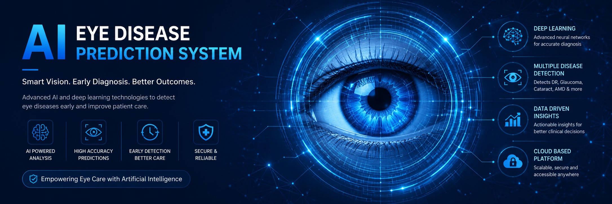
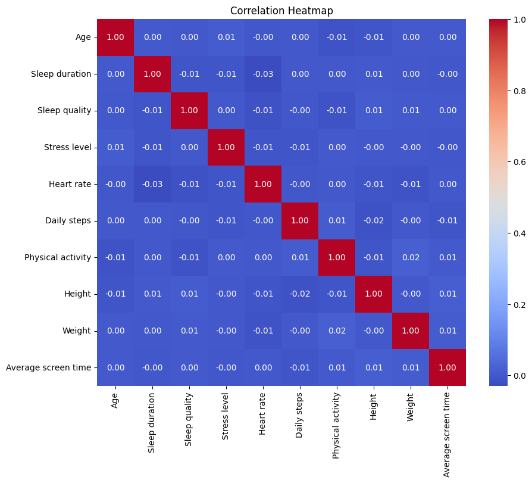
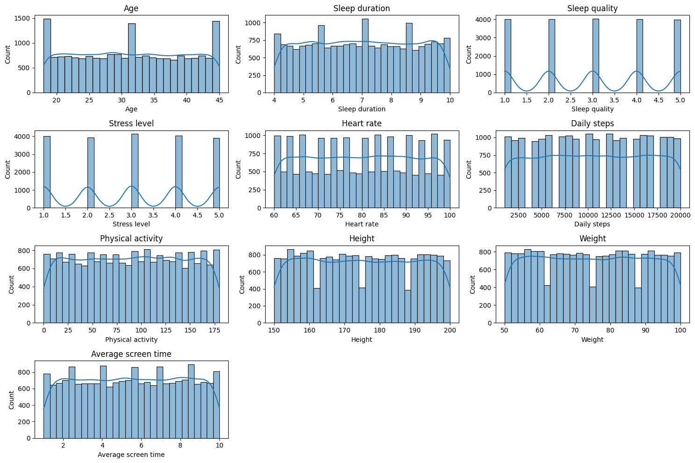
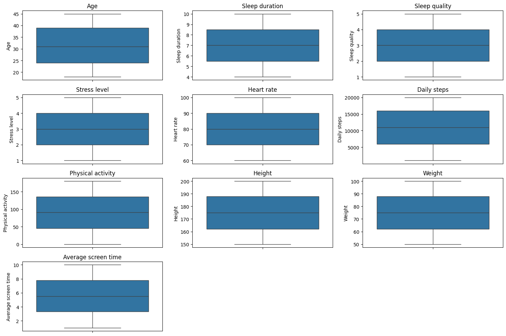
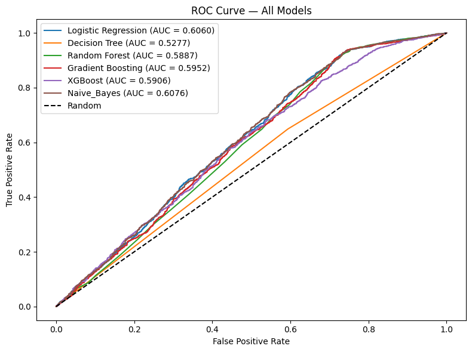

# 👁️ AI Dry Eye Risk Assessment & Lifestyle Recommendation System



An end-to-end Machine Learning project that predicts **Dry Eye Disease** risk based on lifestyle, sleep patterns, and health data — powered by **Random Forest Classifier** and deployed via **FastAPI + Streamlit**.

---

## 🎯 Project Overview

Dry Eye Disease is increasingly common due to modern lifestyle factors such as excessive screen time, poor sleep, and high stress levels. This system provides an AI-powered risk assessment tool that analyzes user health and lifestyle inputs to predict the likelihood of Dry Eye Disease.

> ⚠️ **Disclaimer:** This project is built on a synthetic dataset. Predictions are for educational purposes only and are not a substitute for professional medical advice. Real clinical data would significantly improve model performance.

---

## 🗂️ Project Structure

```
AI Dry Eye Risk Assessment & Lifestyle Recommendation System/
│
├── backend/
│   ├── assets/
│   │   ├── banner.png
│   │   ├── eda_boxplot.png
│   │   ├── eda_histogram.png
│   │   ├── eda_heatmap.png
│   │   └── roc_curve.png
│   │
│   ├── data/
│   │   ├── raw/
│   │   └── processed/
│   │
│   ├── notebooks/
│   │   ├── 01_eda.ipynb
│   │   └── 02_model_training.ipynb
│   │
│   ├── model/
│   │   └── dry_eye_model.pkl
│   │
│   ├── api/
│   │   ├── main.py
│   │   ├── predict.py
│   │   ├── schemas.py
│   │   └── utils.py
│   │
│   └── requirements.txt
│
├── frontend/
│   ├── app.py
│   └── requirements.txt
│
├── README.md
└── .gitignore
```

---

## 📊 Exploratory Data Analysis

### Correlation Heatmap


### Feature Distribution


### Outlier Analysis


---

## 🤖 Model Development

### Algorithms Compared

| Model | CV F1 Score | False Negative | False Positive |
|-------|-------------|----------------|----------------|
| Logistic Regression | 0.5987 | 80 | 1184 |
| Decision Tree | 0.5711 | 904 | 810 |
| **Random Forest** ✅ | **0.6401** | **158** | **1047** |
| Gradient Boosting | 0.6486 | 166 | 1037 |
| XGBoost | 0.6157 | 391 | 995 |
| Naive Bayes | 0.5538 | 36 | 1306 |

### Why Random Forest?

- ✅ **Highest F1 Score** among balanced models
- ✅ **Lower False Negative (158)** — critical in healthcare
- ✅ **Faster inference** than Gradient Boosting
- ✅ **No feature scaling** required

### ROC Curve — All Models


### Hyperparameter Tuning

Used **RandomizedSearchCV** with `StratifiedKFold (cv=5)` and `f1_weighted` scoring:

```python
Best Params:
- n_estimators     : 500
- max_depth        : 10
- max_features     : sqrt
- min_samples_split: 2
- min_samples_leaf : 1

Best F1 Score: 0.6473
```

### Final Model Performance

```
Accuracy  : 0.7005
F1 Score  : 0.65
Precision : 0.70
Recall    : 0.70

Confusion Matrix:
              Predicted No    Predicted Yes
Actual No         355              1038
Actual Yes        160              2447
```

---

## 🛠️ Tech Stack

| Layer | Technology |
|-------|-----------|
| Language | Python 3.11 |
| ML | Scikit-learn, XGBoost |
| API | FastAPI, Uvicorn |
| Frontend | Streamlit |
| Data | Pandas, NumPy |
| Visualization | Matplotlib, Seaborn |
| Model Saving | Joblib |

---

## 🚀 How to Run

### 1 — Clone Repository
```bash
git clone https://github.com/mushahidhussainleel/ai-dry-eye-risk-assessment-lifestyle-recommendation-system.git
cd dry-eye-risk-assessment
```

### 2 — Backend Setup
```bash
cd backend
pip install -r requirements.txt
cd api
uvicorn main:app --reload
```

API will run on: `http://127.0.0.1:8000`
Swagger Docs: `http://127.0.0.1:8000/docs`

### 3 — Frontend Setup
```bash
# New terminal
cd frontend
pip install -r requirements.txt
streamlit run app.py
```

Frontend will run on: `http://localhost:8501`

---

## 📡 API Endpoints

| Method | Endpoint | Description |
|--------|----------|-------------|
| GET | `/` | API Home Page |
| POST | `/predict` | Dry Eye Risk Prediction |

### Sample Request
```json
{
  "Gender": "M",
  "Age": 25,
  "Sleep_duration": 6.0,
  "Sleep_quality": 2,
  "Stress_level": 7,
  "Average_screen_time": 10.0,
  "Blue_light_filter": "N",
  "Discomfort_Eye_strain": "Y",
  "Systolic_BP": 125,
  "Diastolic_BP": 77
}
```

### Sample Response
```json
{
  "prediction": 1,
  "result": "Dry Eye Disease Detected",
  "risk_level": "Moderate",
  "probability": 0.749,
  "recommendation": "Please consult an eye specialist as soon as possible."
}
```

---

## 🔮 Future Enhancements

- [ ] Real clinical dataset integration for better accuracy
- [ ] SHAP values for feature importance explanation
- [ ] JWT Authentication for API security
- [ ] Docker containerization
- [ ] Cloud deployment (AWS / Render)

---

## 👨‍💻 Developer

**Mushahid Hussain**
Python Backend Developer | ML Student

[](https://github.com/mushahidhussainleel)
[](https://linkedin.com/in/mushahid-hussain-dev)

---

## 🙏 Acknowledgements

Special thanks to:
- **Sir Zafar Iqbal** — Project Guidance & Evaluation
- **Dataset Source** — [Dry Eye Disease Dataset — Kaggle](https://www.kaggle.com/datasets/dakshnagra/dry-eye-disease)

---

*Built with ❤️ using FastAPI + Streamlit + Scikit-learn*
